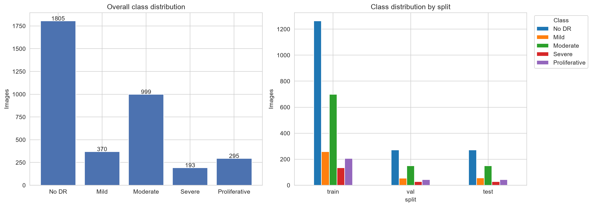
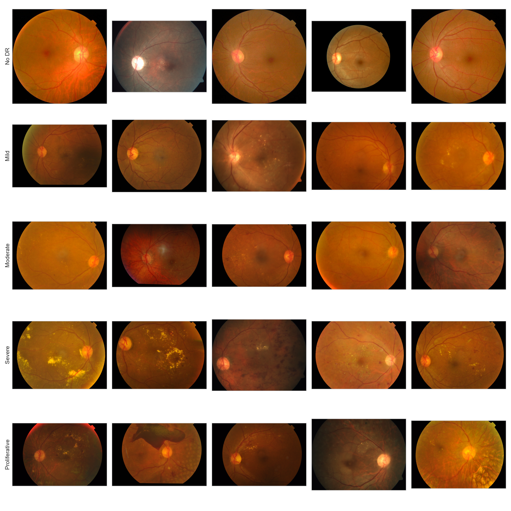
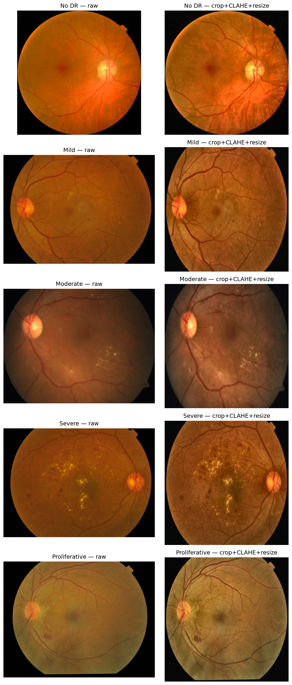
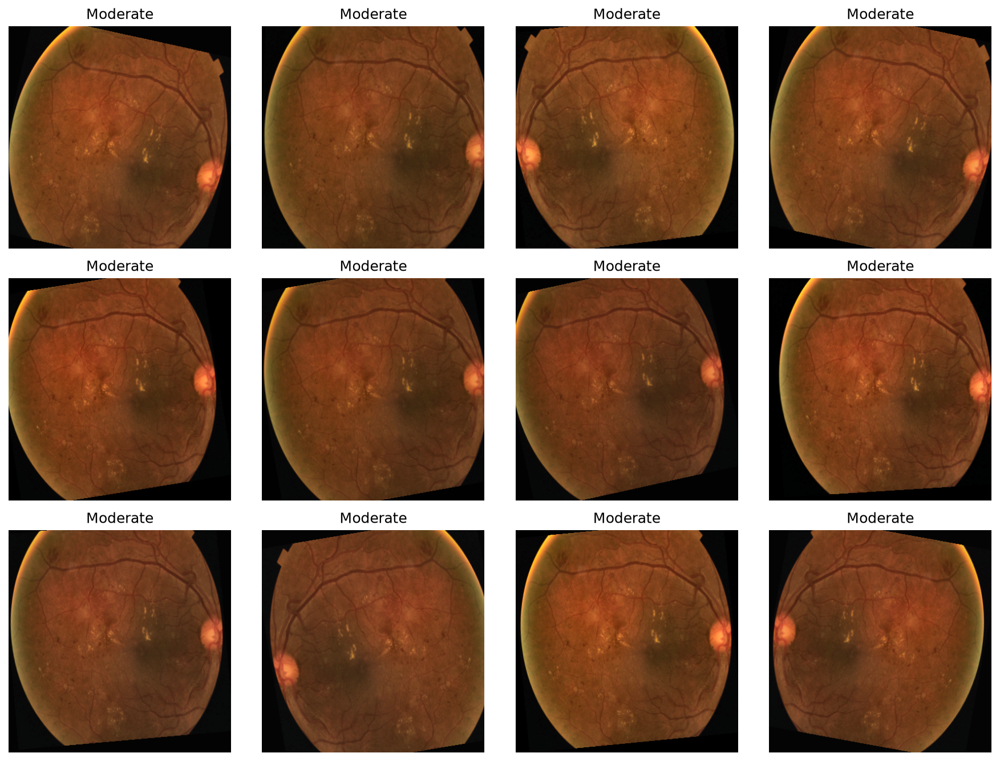
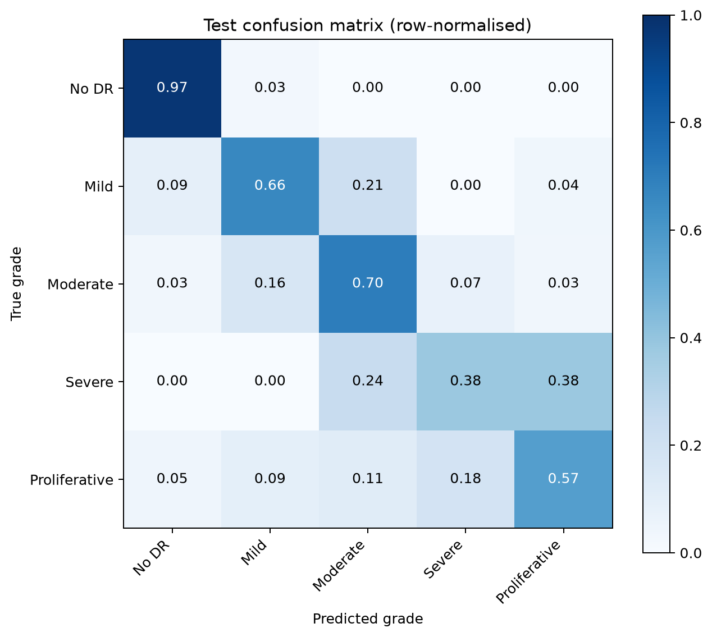
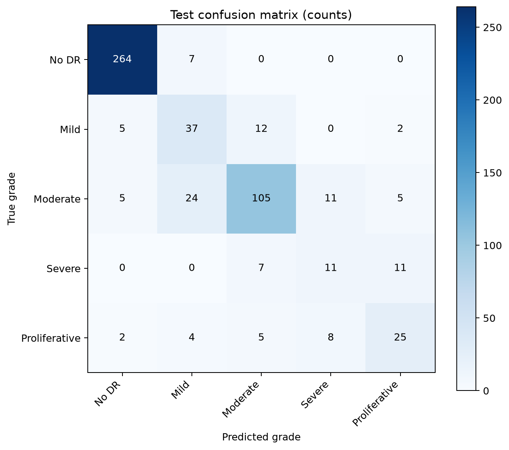
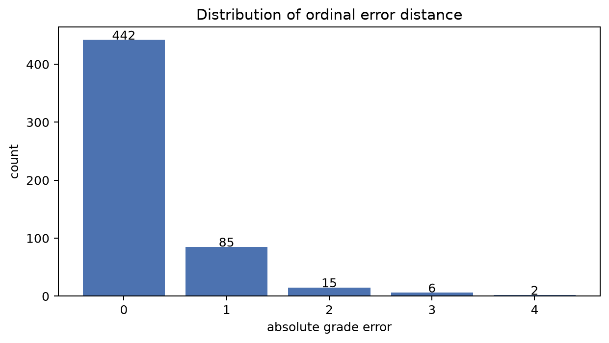
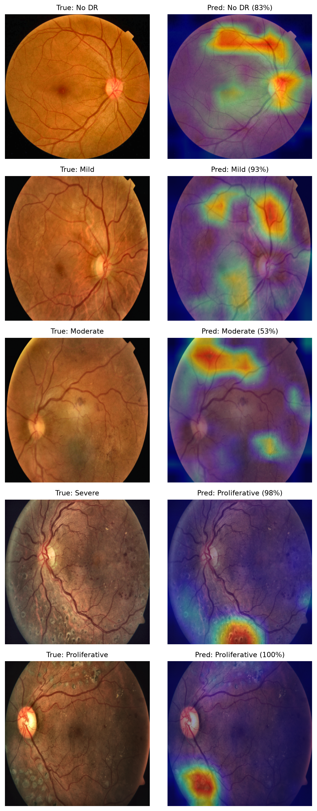
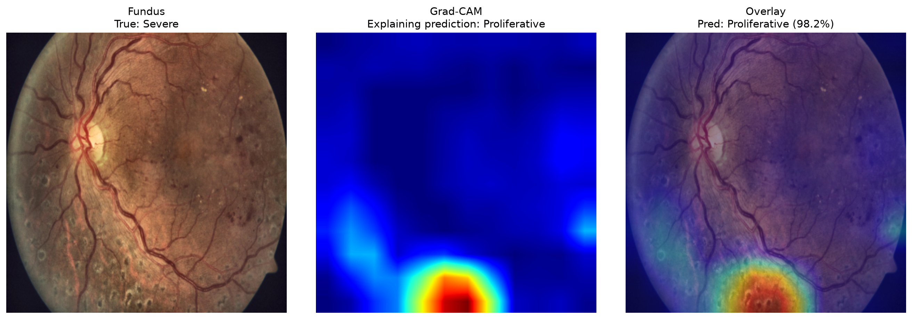

# Diabetic Retinopathy Severity Classification with EfficientNet-B3 and Grad-CAM

## Overview

This project develops an end-to-end deep learning pipeline for **Diabetic Retinopathy (DR) severity classification** using retinal fundus images from the **APTOS 2019 Blindness Detection dataset**.

The system classifies retinal images into five diabetic retinopathy severity levels:

| Class | Severity         |
| ----- | ---------------- |
| 0     | No DR            |
| 1     | Mild             |
| 2     | Moderate         |
| 3     | Severe           |
| 4     | Proliferative DR |

The final pipeline covers exploratory data analysis, image preprocessing, class imbalance handling, EfficientNet-B3 model training, model evaluation, and Grad-CAM explainability.

### Final Integrated Model Summary

| Metric                          |              Final Result |
| ------------------------------- | ------------------------: |
| Best Validation QWK             |          **0.8579** |
| Test QWK                        |          **0.8741** |
| Test Accuracy                   | **0.8036 (80.36%)** |
| Macro F1                        |          **0.6487** |
| Balanced Accuracy               |          **0.6565** |
| Weighted F1                     |          **0.8054** |
| Macro ROC-AUC (OvR)             |          **0.9030** |
| Predictions within ±1 DR grade |          **95.82%** |
| Mean Absolute Grade Error       |          **0.2564** |

The final results are based on the **integrated EfficientNet-B3 pipeline** evaluated on the untouched 550-image test set. Individual research results are kept separate from the final integrated model results.

---

## Project Objectives

The main objectives of this project are to:

- Explore the characteristics and class distribution of the APTOS 2019 dataset.
- Develop a consistent preprocessing pipeline for retinal fundus images.
- Address the significant class imbalance present in the dataset.
- Train an EfficientNet-B3 deep learning model for five-class DR severity classification.
- Evaluate model performance using classification and ordinal classification metrics.
- Apply Grad-CAM to investigate which retinal regions influence model predictions.

---

## Dataset

The project uses the **APTOS 2019 Blindness Detection** dataset, which contains **3,662 retinal fundus photographs** labelled according to diabetic retinopathy severity.

The class distribution is:

| Class | Severity         | Images | Share |
| ----- | ---------------- | -----: | ----: |
| 0     | No DR            |  1,805 | 49.3% |
| 1     | Mild             |    370 | 10.1% |
| 2     | Moderate         |    999 | 27.3% |
| 3     | Severe           |    193 |  5.3% |
| 4     | Proliferative DR |    295 |  8.1% |

The dataset is strongly imbalanced, with almost half of the images belonging to the No DR class while Severe DR represents only about 5% of the data.

A fixed stratified split with random seed `42` is used throughout the final pipeline:

| Split      | Images | Approx. Share | Purpose                    |
| ---------- | -----: | ------------: | -------------------------- |
| Training   |  2,563 |           70% | Model fitting              |
| Validation |    549 |           15% | Checkpoint/model selection |
| Test       |    550 |           15% | Final locked evaluation    |

Due to the size of the image dataset, the raw and generated image files are not stored directly in this repository.

The dataset can be obtained from the APTOS 2019 Blindness Detection competition on Kaggle.

---

## Project Pipeline

The final implementation is organized into five notebooks.

### 1. Exploratory Data Analysis

`01_eda.ipynb`

Explores the dataset before model development, including:

- Class distribution
- Class imbalance
- Image dimensions and resolution
- Image brightness and contrast
- Sample retinal images from each severity class
- Image quality characteristics
- Dark-border and retinal-field analysis

The EDA verified all **3,662 labelled images** and found no missing or unreadable image files. The dataset contains images in multiple resolutions with substantial variation in brightness, contrast, framing and dark-border content.

The results of the EDA were used to guide preprocessing and model-development decisions.

Example EDA outputs:





### 2. Image Preprocessing

`02_preprocessing.ipynb`

Implements the preprocessing pipeline used to prepare retinal images for model training.

The final preprocessing process is:

```text
Raw retinal image
      ↓
Tight retinal-field crop
      ↓
Mild CLAHE on LAB luminance
      ↓
Resize to 384 × 384
      ↓
ImageNet normalization
```

The final pipeline was informed by a controlled comparison of five preprocessing approaches:

- Cropped baseline
- LAB-luminance CLAHE
- Gamma correction
- Global histogram equalization
- Green-channel CLAHE

LAB-luminance CLAHE was selected by the predefined validation rule, reaching:

| Preprocessing Result |            Score |
| -------------------- | ---------------: |
| Validation QWK       | **0.8842** |
| Validation Macro F1  | **0.6858** |
| Test QWK             | **0.8828** |
| Test Macro F1        | **0.6579** |

The final integrated pipeline uses a milder CLAHE configuration at **384 × 384**.

Data augmentation is incorporated into the training pipeline only, while validation and test images remain unaugmented.

Example preprocessing outputs:





### 3. Model Training

`03_model_training.ipynb`

Implements the deep learning training pipeline using **EfficientNet-B3**.

The model uses transfer learning to leverage representations learned from ImageNet while adapting the network to five-class diabetic retinopathy severity classification.

The training process is:

```text
ImageNet-pretrained EfficientNet-B3
      ↓
Head-only training
      ↓
Full-network fine-tuning
      ↓
Validation QWK checkpoint selection
      ↓
Best model checkpoint
```

The model is trained using:

- `384 × 384` inputs
- Train-only data augmentation
- Effective-number class weights
- Weighted cross-entropy loss
- Validation QWK as the checkpoint-selection metric

The effective-number class weights used for grades 0–4 are:

```text
0: 0.3315
1: 1.0419
2: 0.4727
3: 1.8824
4: 1.2714
```

The Severe class receives the largest weight because it is the rarest class.

Training progression:

```text
Head-only stage best validation QWK: 0.7758
                    ↓
Full fine-tuning
                    ↓
Best validation QWK: 0.8579
Fine-tuning epoch: 19
Overall epoch: 24
```

The selected checkpoint is saved as:

```text
artifacts/checkpoints/efficientnet_b3_best_qwk.pt
```

### 4. Model Evaluation

`04_evaluation.ipynb`

Evaluates the trained model on the untouched **550-image test set**.

Evaluation outputs include:

- Classification report
- Confusion matrix
- Normalized confusion matrix
- Test predictions
- Class-wise performance
- Error-distance analysis
- Evaluation summary and metrics

Because DR severity is ordinal, evaluation is not limited to simple classification accuracy. The analysis also considers how far incorrect predictions are from the true severity grade.

#### Final Integrated Test Results

| Metric                    |        Final Test Result |
| ------------------------- | -----------------------: |
| QWK                       |         **0.8741** |
| QWK 95% Bootstrap CI      | **0.8361–0.9094** |
| Accuracy                  |         **0.8036** |
| Macro F1                  |         **0.6487** |
| Balanced Accuracy         |         **0.6565** |
| Weighted F1               |         **0.8054** |
| Minority Mean Recall      |         **0.5361** |
| Macro ROC-AUC (OvR)       |         **0.9030** |
| Mean Absolute Grade Error |         **0.2564** |
| Within ±1 Grade          |         **95.82%** |

#### Final Test Error Summary

Out of 550 test images:

```text
Exactly correct:             442
Incorrect predictions:       108
One grade away:               85
Two or more grades away:      23
Within ±1 severity grade:  95.82%
```

Among the 108 errors:

- **78.7%** were adjacent-grade mistakes.
- **21.3%** were two or more grades away.

#### Per-Class Performance

| Class            | Precision |          Recall |    F1 | Support |
| ---------------- | --------: | --------------: | ----: | ------: |
| No DR            |     0.957 | **0.974** | 0.965 |     271 |
| Mild             |     0.514 |           0.661 | 0.578 |      56 |
| Moderate         |     0.814 |           0.700 | 0.753 |     150 |
| Severe           |     0.367 | **0.379** | 0.373 |      29 |
| Proliferative DR |     0.581 |           0.568 | 0.575 |      44 |

The major remaining weakness is the **Severe** class, which has the lowest recall.

Evaluation outputs:







### 5. Grad-CAM Explainability

`05_gradcam_explainability.ipynb`

Uses **Gradient-weighted Class Activation Mapping (Grad-CAM)** to examine the regions of retinal images that influence model predictions.

Grad-CAM visualizations are generated for:

- Correct predictions across DR severity grades
- Incorrect predictions
- Selected difficult cases
- High-confidence model errors

This provides an additional layer of interpretability beyond numerical performance metrics and helps investigate whether the model is focusing on meaningful retinal regions when making predictions.

Example Grad-CAM outputs:





Grad-CAM visualizations are interpreted qualitatively. The APTOS 2019 dataset does not contain lesion-level segmentation masks, so the highlighted regions should not be treated as clinically validated lesion localization.

---

## Repository Structure

```text
diabetic-retinopathy-detection-gradcam/
│
├── 01_eda.ipynb
├── 02_preprocessing.ipynb
├── 03_model_training.ipynb
├── 04_evaluation.ipynb
├── 05_gradcam_explainability.ipynb
│
├── artifacts/
│   ├── checkpoints/
│   │   └── efficientnet_b3_best_qwk.pt
│   ├── preprocessing/
│   │   ├── aptos_preprocessed_384_manifest.csv
│   │   ├── class_weights_effective_number.csv
│   │   └── class_weights_effective_number.npy
│   └── results/
│       ├── classification_report.csv
│       ├── efficientnet_b3_training_history.csv
│       ├── evaluation_summary.json
│       ├── test_metrics.csv
│       ├── test_metrics.json
│       └── test_predictions.csv
│
├── data/
│   ├── eda/
│   ├── preprocessed_384/
│   └── splits/
│       └── aptos_seed42.csv
│
├── studies/
│   ├── 01_eda/
│   │   └── figures/
│   ├── 02_preprocessing/
│   │   └── figures/
│   ├── 04_evaluation/
│   │   └── figures/
│   └── 05_gradcam/
│       └── figures/
│
├── requirements.txt
├── .gitignore
└── README.md
```

---

## Individual Research and Contributions

Before integrating the final pipeline, team members independently investigated different components of the project. These experiments helped inform decisions used in the final implementation.

### Ritika Lal — EDA and Image Preprocessing

**Research areas:**

- Exploratory Data Analysis
- Retinal image characteristics
- Image preprocessing
- Preprocessing experiments
- Data preparation

Individual research repository:

**[Explainable DR Severity Grading – Ritika Lal](https://github.com/ritikalal911/explainable-dr-severity-grading)**

### Peter Bello — Model Training

**Research areas:**

- Model architecture investigation
- Transfer learning
- Model training strategies
- Training configuration and experimentation

**Individual Research Repository:**

**[CV Explainable Diabetic Retinopathy Severity Grading – Peter Bello](https://github.com/cloudbadger44/CV_Explainable-Diabetic-Retinopathy-Severity-Grading)**

### Alain Dika — Class Imbalance and Explainability

**Research areas:**

- Analysis of class imbalance
- Strategies for handling underrepresented DR severity classes
- Explainability techniques

**Individual Research Repository:**

**[DR Imbalance XAI Study – Alain Dika](https://github.com/alaindika/dr-imbalance-xai-study)**

---

## Final Group Integration

The individual research conducted by each team member was used to inform the final group implementation.

The five notebooks located in the root of this repository represent the **final integrated pipeline** rather than separate individual experiments.

```text
EDA
 ↓
Preprocessing
 ↓
Class Imbalance Handling
 ↓
EfficientNet-B3 Training
 ↓
Evaluation
 ↓
Grad-CAM Explainability
```

The final integrated implementation combines:

- Ritika Lal's EDA and preprocessing research to guide retinal cropping and CLAHE-based image preparation.
- Peter Bello's architecture and transfer-learning research to support the EfficientNet family and full fine-tuning.
- Alain Dika's class-imbalance and explainability research to support weighted loss and Grad-CAM-based model auditing.

This separation allows the repository to preserve a clean final implementation while individual repositories document the experimentation and research that contributed to the final design.

### Final Integrated Outcome

The final group system achieved:

```text
Best validation QWK:         0.8579
Final test QWK:              0.8741
Final test accuracy:         80.36%
Final macro F1:              0.6487
Final balanced accuracy:     0.6565
Final macro ROC-AUC:         0.9030
Predictions within ±1 grade: 95.82%
```

These values belong to the final integrated EfficientNet-B3 model and should not be arithmetically combined with the separate individual research experiment scores.

---

## Installation

Clone the repository:

```bash
git clone https://github.com/ritikalal911/diabetic-retinopathy-detection-gradcam.git
cd diabetic-retinopathy-detection-gradcam
```

Install the required Python packages:

```bash
pip install -r requirements.txt
```

### Main Dependencies

- PyTorch
- Torchvision
- NumPy
- Pandas
- Scikit-learn
- Matplotlib
- Seaborn
- OpenCV
- Pillow
- tqdm
- Jupyter

---

## Running the Project

The notebooks should be executed in the following order:

```text
01_eda.ipynb
      ↓
02_preprocessing.ipynb
      ↓
03_model_training.ipynb
      ↓
04_evaluation.ipynb
      ↓
05_gradcam_explainability.ipynb
```

### What Each Stage Produces

```text
01_eda.ipynb
      ↓
Dataset audit + split + EDA figures

02_preprocessing.ipynb
      ↓
384×384 processed images + preprocessing manifest + class weights

03_model_training.ipynb
      ↓
Training history + best EfficientNet-B3 checkpoint

04_evaluation.ipynb
      ↓
Test metrics + predictions + classification report
+ confusion matrices + ordinal error analysis

05_gradcam_explainability.ipynb
      ↓
Grad-CAM panels + correct-case explanations
+ high-confidence error explanations
```

The raw APTOS dataset must be downloaded separately before running the complete pipeline.

---

## Generated Outputs

The project produces several artifacts during preprocessing, training and evaluation.

### Model Checkpoint

```text
artifacts/
└── checkpoints/
    └── efficientnet_b3_best_qwk.pt
```

### Preprocessing Outputs

```text
artifacts/
└── preprocessing/
    ├── aptos_preprocessed_384_manifest.csv
    ├── class_weights_effective_number.csv
    └── class_weights_effective_number.npy
```

### Evaluation Outputs

```text
artifacts/
└── results/
    ├── classification_report.csv
    ├── efficientnet_b3_training_history.csv
    ├── evaluation_summary.json
    ├── test_metrics.csv
    ├── test_metrics.json
    └── test_predictions.csv
```

### Visual Outputs

The repository includes:

```text
studies/
├── 01_eda/
│   └── figures/
│       ├── border_crop_fraction.png
│       ├── brightness_contrast_by_class.png
│       ├── brightness_vs_contrast.png
│       ├── class_balance_pie.png
│       ├── class_distribution.png
│       ├── resolution_bar.png
│       └── samples_per_class.png
│
├── 02_preprocessing/
│   └── figures/
│       ├── augmentation_sanity_check.png
│       └── raw_vs_preprocessed.png
│
├── 04_evaluation/
│   └── figures/
│       ├── confusion_matrix_counts.png
│       ├── confusion_matrix_normalized.png
│       └── error_distance.png
│
└── 05_gradcam/
    └── figures/
        ├── gradcam_by_grade_panel.png
        ├── gradcam_true_0_pred_0_1d3e9b939732.png
        ├── gradcam_true_1_pred_1_4aa07d720638.png
        ├── gradcam_true_2_pred_2_69df7ade0575.png
        ├── gradcam_true_3_pred_4_3435fd8675a2.png
        ├── gradcam_true_4_pred_4_61f403fdb434.png
        ├── mistake_true_3_pred_4_19244004583f.png
        ├── mistake_true_3_pred_4_3435fd8675a2.png
        ├── mistake_true_3_pred_4_af3b0115aad1.png
        ├── mistake_true_3_pred_4_b019a49787c1.png
        └── mistake_true_3_pred_4_e1fb532f55df.png
```

The most important final outputs are the trained checkpoint, the test metrics and predictions, the confusion matrices, the ordinal error analysis, and the Grad-CAM explanation figures.

---

## Technologies Used

**Programming Language**

- Python

**Deep Learning**

- PyTorch
- Torchvision
- EfficientNet-B3
- Transfer Learning

**Computer Vision**

- OpenCV
- Pillow
- Grad-CAM

**Data Analysis**

- NumPy
- Pandas

**Machine Learning & Evaluation**

- Scikit-learn

**Visualization**

- Matplotlib
- Seaborn

---

## Team Members

| Team Member           | Primary Research Area            |
| --------------------- | -------------------------------- |
| **Ritika Lal**  | EDA & Image Preprocessing        |
| **Peter Bello** | Model Training                   |
| **Alain Dika**  | Class Imbalance & Explainability |

All team members contributed to the integration and development of the final project pipeline.

---

## Final Results and Key Findings

The completed project demonstrates an end-to-end research-to-implementation workflow for explainable diabetic retinopathy severity classification.

### Key Results

- The final **EfficientNet-B3** model achieved a test **QWK of 0.8741**.
- Test accuracy reached **80.36%**.
- Macro ROC-AUC reached **0.9030**.
- **442 of 550** test images were classified exactly correctly.
- **95.82%** of predictions were either correct or within one adjacent severity grade.
- **78.7%** of incorrect predictions were adjacent-grade errors.
- No DR achieved the strongest recall at **0.9742**.
- Severe remained the most difficult class, with recall of **0.3793**.
- Grad-CAM provided qualitative evidence about which retinal regions influenced predictions, including both correct predictions and high-confidence mistakes.

### Final Process

```text
APTOS 2019
   ↓
Data Audit and EDA
   ↓
Seed-42 Stratified 70/15/15 Split
   ↓
Tight Retinal Crop
   ↓
Mild LAB CLAHE
   ↓
384×384 Images
   ↓
Train-Only Augmentation
   ↓
Effective-Number Weighted Cross-Entropy
   ↓
ImageNet EfficientNet-B3
   ↓
Head Training
   ↓
Full Fine-Tuning
   ↓
Validation-QWK Checkpoint Selection
   ↓
Locked Test Evaluation
   ↓
Grad-CAM Explainability Audit
```

The project therefore combines model performance, ordinal error analysis and explainability rather than relying on accuracy alone.

---

## Disclaimer

This project was developed for **academic and research purposes**.

The model is not a medical diagnostic system and should not be used to make clinical decisions. Model predictions and Grad-CAM visualizations are intended only for experimentation and analysis of deep learning methods for diabetic retinopathy severity classification.
